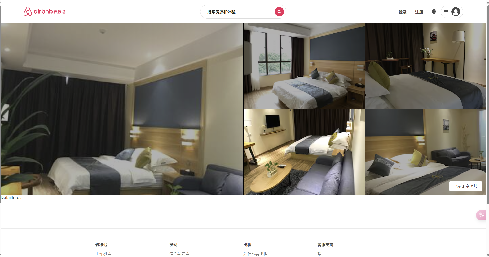

# Airbnb仿写项目
## 项目介绍
开发模拟 Airbnb 房屋租赁平台的部分功能，包括首页、房源展示，房屋详情查看等核心模块。
## 技术栈
* 前端技术栈
    * 核心框架：React
    * 状态管理：Redux Toolkit
    * 路由管理：React Router 
    * 样式： Styled Components 
    * UI组件库: Ant Design 
* 工程化工具
    *  CI/CD: Jenkins  
## 项目演示
### 首页展示

*首页有多个Section，结构高度相似，抽取出`SectionHeader`,`SectionRooms`,`SectionFooters`组件复用；同时单个房屋展示大量复用，抽取为`RoomItem`组件*
### 房源展示

*分页展示全部房屋数据，房屋图片可轮播查看，使用`Indicator`组件指示查看轮播进度；点击房屋图片可进入详情页面查看*
### 房屋详情展示

*可高亮正在查看的图片，点击可进入更房屋图片浏览*
##### 房屋图片展示

*使用`CSSTransition, SwitchTransition`实现图片切换效果，图片预览复用`Indicator`组件*

## 项目结构
```bash
├─assets/ #静态资源 
├─base-ui/ #通用组件
│  ├─indicator #轮播图指示器
│  ├─pictures-brower #图片浏览器
│  └─scroll-view #水平滚动组件
├─components #项目组件
│  ├─app-footer #页面底部
│  ├─app-header #页面顶部
│  ├─longfor-item #可能想去
│  ├─room-item #单房屋展示
│  ├─section-footer
│  ├─section-header
│  ├─section-list
│  └─section-tabs
├─hooks 
├─router #配置路由
├─services #网络封装
├─store #状态管理
└─views # 页面
    ├─detail #房屋详情
    ├─entire #房源展示
    └─home #主页
```
### 更多细节
* 状态管理
    * 状态管理使用`redux toolkit`，将整个状态(state)划分为`home`,`entire`,`detail`三个slice，其中`home`，`slice`的数据是通过接口动态加载，`detail`数据是复用`entire`
* 网络请求
    * 是封装一个统一的请求类，集中管理所有 API 调用
* 路由管理
    * 使用`React.lazy`通过按需动态导入组件,需要配合 `<Suspense> `显示加载状态
